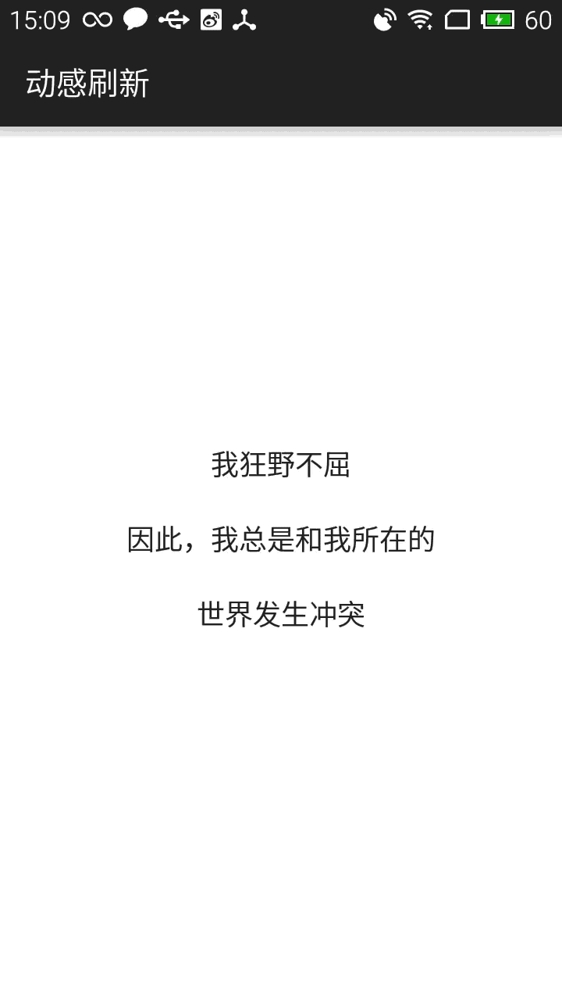

## JellyRefresh

[](http://jellyrefresh.osslab.online/) [](http://developer.android.com/index.html) [](https://android-arsenal.com/api?level=15) [](http://osslab.online/)


一款非常有趣的下拉刷新组件，包含水纹动画效果。




## 使用方法

首先，你需要导入模块项目或者添加依赖类库：

```Gradle
dependencies {
    compile 'online.osslab:JellyRefresh:1.0.0'
}
```


#### 布局文件
```xml
<online.osslab.JellyRefreshLayout
        xmlns:app="http://schemas.android.com/apk/res-auto"
        android:id="@+id/refreshLayout"
        android:layout_width="match_parent"
        android:layout_height="match_parent"
        app:backColor="#ff8b90af"
        app:foreColor="#ffffffff"
        app:smaller="6" >

        <ListView
            android:id="@+id/listView"
            android:background="#ffffffff"
            android:layout_width="match_parent"
            android:layout_height="match_parent" />

    </online.osslab.JellyRefreshLayout>
```


######  `属性说明：`
```xml
    app:smaller      // 视图高度
    app:backColor    // 背景颜色
    app:foreColor    // 前景颜色
```

#### 回调函数

```java
refreshLayout.setOnRefreshListener(
            new JellyRefreshLayout.OnJellyRefreshListener() {

            @Override
            public void refreshing() {
                // do something when refresh starts
            }

            @Override
            public void completeRefresh() {
                // do something when refresh complete
            }
        });
```

当刷新操作成功后（例如，图片加载完成），需要调用该方法结束进程：

```java
refreshLayout.finishRefreshing();
```

## 关于作者

- [wall-e@live.cn](mailto:wall-e@live.cn)
- [开源软件实验室](http://osslab.online/)


## 许可协议

    Copyright 2015 tuesda

    Licensed under the Apache License, Version 2.0 (the "License");
    you may not use this file except in compliance with the License.
    You may obtain a copy of the License at

       http://www.apache.org/licenses/LICENSE-2.0

    Unless required by applicable law or agreed to in writing, software
    distributed under the License is distributed on an "AS IS" BASIS,
    WITHOUT WARRANTIES OR CONDITIONS OF ANY KIND, either express or implied.
    See the License for the specific language governing permissions and
    limitations under the License.

